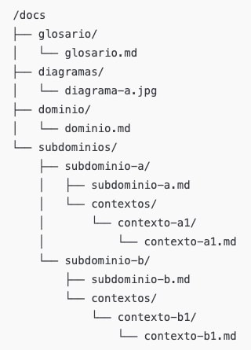

# Documentacion del sistema de Congresos

Este repositorio alberga toda la documentacion para el sistema de manejo de Congresos y Conferencias.
Aqui podras encontrar documentacion, especificaciones, requerimientos, diagramas y modelos, etc... relevantes para entender y contribuir al proyecto.

  

## Introduccion

El ITT organiza periodicamente congresos donde expositores imparten conferencias para los alumnos del ITT (y otras instituciones), para que puedan obtener conocimiento valioso y actual de las industrias a las que pronto se integraran como parte de la fuerza laboral.

Organizar estos eventos tipo congreso requiere de mucha labor y colaboracion por parte de todos los involucrados, desde los planeadores hasta la potencial audiencia.

Este documento asume que no hace falta convencer al lector de que la coordinacion de congresos es muy estresante para todos los involucrados. Gran parte del estres causado se debe a retrasos en la comunicacion, trabajo duplicado y error humano. Todos esos son problemas que podrian solucionarse mediante software y este documento detalla una propuesta de solucion.

## Justificacion

El ITT requiere de una plataforma de software que le facilite la coordinacion y participacion en eventos tipo congreso a todos los involucrados, desde quienes planean y representan estos eventos, hasta la potencial audiencia y en pequeña parte al publico general.

La administracion requiere la capacidad de dar de alta eventos y sus representantes para que estos puedan llevar a cabo toda la coordinacion necesaria desde la concepcion de un evento hasta su cierre.

Los planeadores requieren las herramientas necesarias para definir las conferencias que desean incluir en sus congresos, tambien desean invitar a los expositores que impartiran las conferencias, recultar al staff necesario para llevar a cabo los congresos y controlar el acceso a las conferencias durante el congreso solo a los participantes correctos.

Los expositores requieren poder comunicar su imagen y semblanza para atraer a su posible audiencia asi como saber cuando y donde podran dar sus conferencias y a que tamaño de audiencia una vez llegada la fecha del congreso.

Los estudiantes requieren poder saber que congresos estan proximos, cuales son sus fechas y ubicaciones, quienes seran los expositores, el cupo maximo, y tambien requieren poder inscribirse para garantizar su lugar en la audiencia.

## Alcance

Se implementara un sistema web que sera usado de manera y en etapas distintas dependiendo del rol que tenga el usuario en cuestion. A cada usuario segun su rol, se le presentara una faceta muy distinta del sistema donde la informacion presente y las posibles acciones a tomar cambiaran dinamicamente dependiendo del usuario y del momento dado.

Se identifican los siguientes tipos de usuarios del sistema:
 - Administrador
 - Organizador
 - Staff
 - Alumno

Tambien se identifican las siguientes areas de interes:
 - Organizadores y Staff
 - Congresos
 - Conferencias
 - Boletos
 - Paso de lista (asistencias)

El sistema proveera a los participantes las siguientes caracteristicas segun el area de interes.

#### Para la administracion.
 - Manejar congresos:
 - Registrar, editar, autorizar, etc…
 - Curar la lista publica de congresos proximos.
 - Definir responsabilidades.
 - Manejar staff general.
 - Registrar, editar, autorizar, etc…
 - Asignar organizadores a congresos.
 - Manejar alumnos:
   - Registrar, editar, autorizar, etc…

#### Para los planeadores.
 - Manejo de sus congresos asignados.
 - Manejo de conferencias:
 - Registro, edicion, asignar expositor, etc…
 - Manejo de staff:
   - Registro, edicion, autorizacion, asignacion de responsabilidades, etc…
 - Manejo de boletos:
   - Registrar, editar, autorizar, etc…
 - Manejo de asistencias a conferencias:
 - Registrar asistencia (validar boleto).
 - Consultar audiencia.

#### Para el staff.
 - Editar su perfil.
 - Seleccionar responsabilidades deseadas (o dicho de otra forma listar sus potenciales habilidades y conpetencias).
 - Consultar congresos.
 - Ofrecerse como voluntario a un congreso.
 - Consultar sus congresos asignados y autorizados.
 - Comprobar acceso al congreso.
 - Validar boletos.

#### Para los alumnos.
 - Registrarse.
 - Editar su perfil.
 - Consultar los congresos proximos.
 - Consultar conferencias.
 - Inscribirse a congreso.
 - Consultar sus boletos.
 - Registrar su asistencia a una conferencia.
 - Consultar sus asistencias.

## Como leer esta documentacion.

El sistema esta diseñado usando una mezcla de metodologias, encabezada por Diseño Dirigido por Dominios (DDD).
La estructura de este repositorio de documentacion refleja enfoque y planteamiento basado en Dominios.

El siguiente archivo que deberias leer para comprender el Dominio Principal del sistema es: [Dominio](docs/dominio/dominio.md)

### Estructura del repositorio

  

### Explicación de la estructura

#### `/glosario`
Contiene el archivo `glosario.md` con la definición de términos clave, conceptos técnicos y de negocio.  
→ Sirve para mantener un **lenguaje ubicuo** dentro de la organización.

#### `/diagramas`
Carpeta para almacenar diagramas de alto nivel del sistema (ej. diagramas de contexto, flujos de eventos, dependencias).  
→ Facilita la **visualización rápida** del sistema y sus relaciones.

#### `/dominio`
Contiene `dominio.md`, el archivo principal que describe el **dominio central** del sistema:

- Su propósito.  
- Sus conceptos fundamentales.  
- Su relación con los subdominios.  

→ Es el **punto de partida** para entender la arquitectura conceptual.

#### `/subdominios`
Carpeta que agrupa los **subdominios identificados** dentro del sistema.  
Cada subdominio tiene:

- Un archivo raíz (`subdominio-x.md`) que explica su alcance, propósito y límites.  
- Una subcarpeta `/contextos` donde se documentan los **Bounded Contexts (contextos delimitados)** relacionados a ese subdominio.

##### Dentro de cada `/contextos`:
- Un archivo `contexto-x.md` que detalla el **BC**, incluyendo:  
  - Sus **agregados**, **entidades** y **objetos de valor**.  
  - Sus **eventos de dominio**, **comandos**, **consultas** y **operaciones**.  
  - Sus relaciones con otros contextos (**upstream/downstream**).  

El siguiente archivo que deberias leer para comprender el Dominio Principal del sistema es: [Dominio](docs/dominio/dominio.md)
